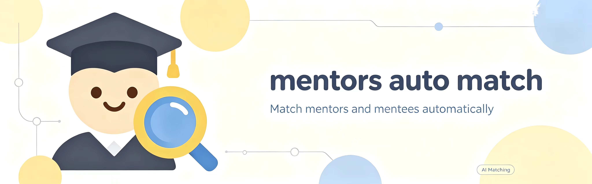

[](LICENSE)




# MentorMatch · 导师匹配助手

把简历（或者 research plan）丢进去，选个学位去 CSRankings 捞一批导师，挨个算匹配度，最后按分数排好告诉你该给谁发邮件。

**目前只覆盖计算机方向**：计算机视觉、NLP、机器学习、系统、安全这些。

生化环材、社科、文科基本没数据, 后续可能会有更新。

## 它能干这几件事

- 传 PDF → 校验 → 提取文本
- 按你勾的院校抓导师：姓名、院系、主页、ORCID、近 5 年发表的会议领域
- 匹配度分高/中/低，给出重合的关键词和理由；开 LLM 的话能识别同一个意思的不同说法
- 本地 SQLite 存着，抓过的导师不重复抓，下次打开还在
- 随时取消，已抓到的记录保留

## 怎么拿到软件

目前只支持三种系统：

| 系统 | 文件 |
| --- | --- |
| macOS（M 系列 / Apple Silicon） | `MentorMatch-macos-arm64.dmg` |
| macOS（Intel） | `MentorMatch-macos-intel.dmg` |
| Windows 64 位 | `MentorMatch-windows-x64.zip`（解压后跑 `MentorMatch.exe`） |


## 怎么用

1. 选 PDF（简历或 research plan 都行），选 硕士 / 博士
2. 点开始匹配。抓取阶段进度条按导师走，每 2-5 秒动一次；本地已有的导师会直接跳过
3. 结果按匹配度排序，点卡片看详情和匹配理由

学位这一栏会换掉候选集合：有的导师主页上写了只招博士，选「硕士」就不会出现他。没写招生类型的导师一律保留，宁可多给你看几个。

## 怎么配置

右上角设置，点击修改。

### 1. LLM 接口（最好用llm）

离线模式用 RapidFuzz 做关键词匹配，虽然快，但只认字面上差不多的词。

建议勾选，填三样：

| 场景 | base_url | API Key | model |
| --- | --- | --- | --- |
| 本地 Ollama | `http://localhost:11434/v1` | 留空 | 有什么填什么，比如 `qwen2.5:7b` |
| 云端 OpenAI 兼容接口 | 服务商给的地址 | 你自己的 | 服务商给的模型名 |

国内那几个（百炼、DeepSeek、智谱）都提供 OpenAI 兼容端点，把 `compatible-mode` 那串地址填进 `base_url` 就行。填完点测试连接确认通了再回去跑匹配——不通的话所有导师会变成离线打分。


### 2. 院校名单

741 所，全部来自 CSRankings，带国家代码。上面有搜索框，可以搜英文名、缩写、国家（`Tsinghua` / `Illinois` / `CN`）。

**匹配池就是勾选的这些院校**，库里别的院校的导师不会参与打分（但记录留着，勾回来就不用重抓）。主窗口状态栏会写清楚「库内总共多少位 / 其中勾选的院校内多少位」，自己对一下。

名字必须是 CSRankings 的写法，比如 `Univ. of Illinois at Urbana-Champaign`。写错的会被单独标出来提示「该行抓不到任何导师」，不用等跑完才猜。

### 3. 每校导师数上限

下拉框：每校 10 / 20 / 30 / 50 / 100 位，最后一档是「每校全部导师」。

- 是**每所学校各自的上限**
- 按名单均匀取样，所以不会只抓到姓氏靠前的那几位
- 选「全部」的话，大型院校（CMU 这种）可能上百位，抓取和 LLM 评估都会明显变慢

### 4. 抓取论文 & 请求间隔

抓取论文会去 OpenAlex 查近 5 年发表，结果用来算关键词重合度。每位导师多 1-2 次请求，关掉能快一大半，代价是匹配精度掉一点。

请求间隔默认 1-2 秒，别调到 0——CSRankings 和 OpenAlex 都是免费公共资源，抓崩了大家都用不了。

### 数据存在哪

开发态在项目的 `data/`；装成软件后在系统用户目录：

- macOS：`~/Library/Application Support/MentorMatch`
- Windows：`%APPDATA%\MentorMatch`

里面有 `app.db`（导师库）、`cache/`（CSRankings 的 CSV 缓存，默认 7 天）、`config.json`（**你的 API Key 明文存在这**）。设置页有清空本地数据，想重新抓一遍时用。

## 数据从哪来

就三个来源，都是公开的：

- **CSRankings**（`csrankings.csv` + `generated-author-info.csv`）：导师姓名、院校、个人主页、ORCID、近 N 年发表的会议领域。两个 CSV 加起来 22MB，本地缓存 7 天，否则每次启动都得重下
- **OpenAlex API**：近 5 年论文标题
- **导师个人主页**：职称、招硕士还是博士（靠关键词猜）

**为什么只有计算机**：CSRankings 是按计算机顶会发的论文来收录导师的，所以只有 CS 方向的数据是完整的。国内高校、非 CS 学科的覆盖都不行。

## 已知的坑

1. 不少高校主页打不开（连接重置 / 404 / 超时），所以职称和招生类型经常是空的。连不上的域名不重试，否则一个坏主页就能让进度条冻几分钟
2. 研究方向的覆盖率大概 82%-85%。缺的那部分是 CSRankings 两个 CSV 里同一个人姓名拼写不一致（`Adam Yang 0001` vs `Yaodong Yang 0001`），没有不误配的可靠办法补
3. 离线模式对「同一个概念的不同措辞」识别有限，有条件就开 LLM
4. 抓取偏慢是设计如此：限速 1-2 秒、每位导师 1-2 次请求。100 位大约 5-8 分钟
5. 语义密度那一项是我自己定的代理指标，不对应任何标准定义

## 跑源码 / 开发

```bash
python3 -m venv .venv && source .venv/bin/activate
pip install -r requirements.txt
python run.py
```

改完代码跑一下自检，12 项，不用 GPU 不用网络也能过大部分：

```bash
python tests/test_pdf_checker.py
```

技术栈：Python 3.10+ / PyQt6 / SQLite / rapidfuzz / pypdf。没有前后端分离，没有服务端，没有 Docker。

## 致谢

清洗规则参考了 [Resume-Matcher](https://github.com/srbhr/Resume-Matcher)，爬虫的院校范围和增量去重思路参考了 [RateMySupervisor](https://github.com/kg-eecs/RateMySupervisor) 和 [csrankings-faculty-finder](https://github.com/rbhatia46/csrankings-faculty-finder)。

## License

[PolyForm Noncommercial 1.0.0](LICENSE)：自己学习、科研、写论文、做毕业设计、非营利机构和高校用，都不用问我。要商业使用（包括拿去接私活、做付费服务）得单独找我授权。


**PR 欢迎**，尤其是这几类：

- 别的学科的数据源（医学、经济、社科）
- 更好的导师主页解析（现在靠关键词猜招生类型，太糙）

